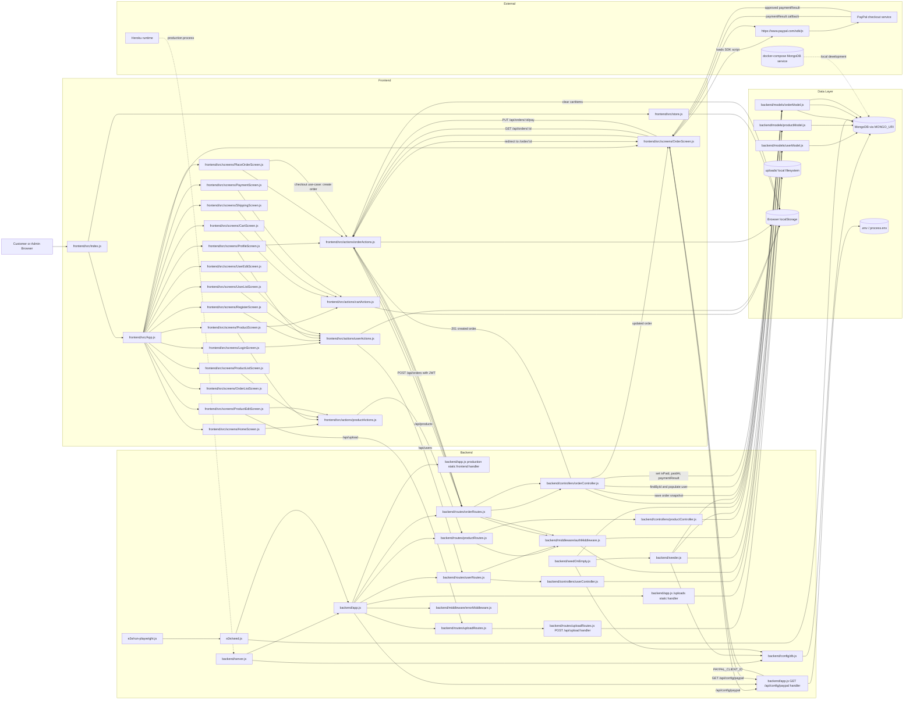

# Architecture

This document maps the current ProShop MERN codebase at container level and highlights the checkout with PayPal payment flow.

## C4 Container Diagram

## Entry Points

- `backend/server.js` starts the Express process, loads environment variables, connects MongoDB, and listens on `PORT`.
- `backend/app.js` mounts API route modules, serves `/uploads`, serves `frontend/build` in production, exposes `GET /api/config/paypal`, and registers error middleware.
- `backend/controllers/productController.js` handles product listing, detail lookup, admin create/update/delete, reviews, and top-rated products.
- `backend/controllers/userController.js` handles login, registration, profile, and admin user management.
- `backend/controllers/orderController.js` handles order creation, order lookup, user order history, admin order listing, PayPal paid updates, and delivery updates.
- `backend/routes/uploadRoutes.js` contains the multer upload handler for `POST /api/upload`.
- `backend/seeder.js` is the import/destroy CLI behind `npm run data:import` and `npm run data:destroy`.
- `backend/seedOnEmpty.js` is the conditional seed CLI behind `npm run data:seed-on-empty`.
- `e2e/run-playwright.js` and `e2e/seed.js` are the Playwright smoke-test command path behind `npm run test:e2e`.
- `frontend/src/index.js` and `frontend/src/App.js` are the SPA browser entry points.
- `frontend/src/actions/*.js` are the browser-side API command handlers used by screens.

## Data Stores

- MongoDB stores users, products, embedded product reviews, and orders through `backend/models/userModel.js`, `backend/models/productModel.js`, and `backend/models/orderModel.js`.
- Browser `localStorage` stores `cartItems`, `shippingAddress`, `paymentMethod`, and `userInfo`.
- `uploads/` stores product image uploads on the local filesystem.
- `.env` / `process.env` provides `MONGO_URI`, `JWT_SECRET`, `PAYPAL_CLIENT_ID`, `PORT`, and `NODE_ENV`.

## External Services

- PayPal checkout is loaded by `frontend/src/screens/OrderScreen.js` from `https://www.paypal.com/sdk/js` using the client ID returned by `GET /api/config/paypal`.
- MongoDB can be local, Docker Compose (`docker-compose.dev.yml` / `docker-compose.yml`), or Atlas in production depending on `MONGO_URI`.
- Heroku is supported by `Procfile` and the `heroku-postbuild` package script.

## Checkout With PayPal Flow

1. The customer builds cart state in `frontend/src/actions/cartActions.js`; the cart is persisted to browser `localStorage`.
2. `frontend/src/screens/PlaceOrderScreen.js` dispatches `createOrder` from `frontend/src/actions/orderActions.js`.
3. `createOrder` sends `POST /api/orders` with the JWT from `userInfo`.
4. `backend/routes/orderRoutes.js` applies `protect` from `backend/middleware/authMiddleware.js`.
5. `backend/controllers/orderController.js` creates an order snapshot through `backend/models/orderModel.js` and persists it in MongoDB.
6. The frontend clears `cartItems` from `localStorage` and navigates to `frontend/src/screens/OrderScreen.js`.
7. `OrderScreen` loads order details through `GET /api/orders/:id`, fetches the PayPal client ID through `GET /api/config/paypal`, and appends the PayPal SDK script.
8. PayPal returns a `paymentResult` callback to `OrderScreen`.
9. `OrderScreen` dispatches `payOrder`, which sends `PUT /api/orders/:id/pay`.
10. `backend/controllers/orderController.js` marks the order paid, stores `paymentResult`, and saves the updated order in MongoDB.
